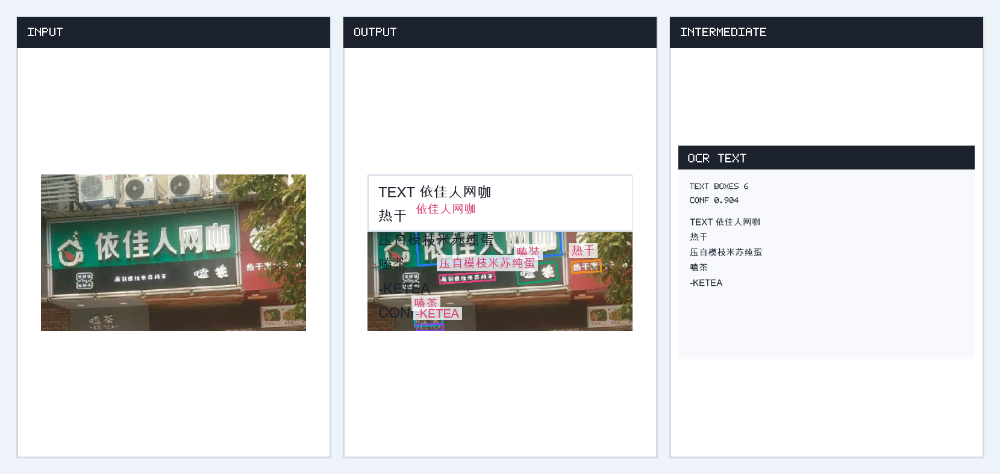
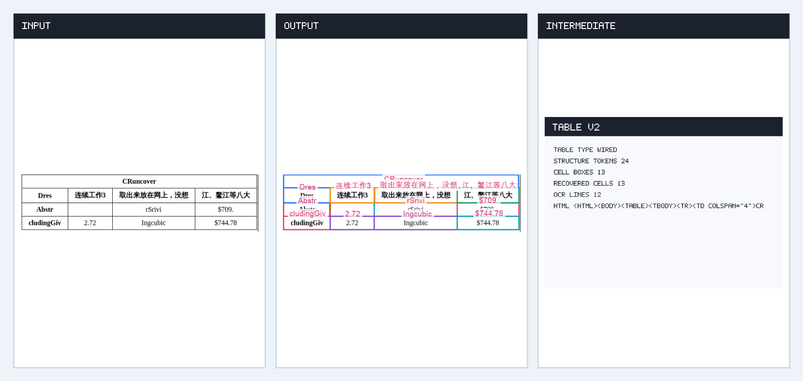
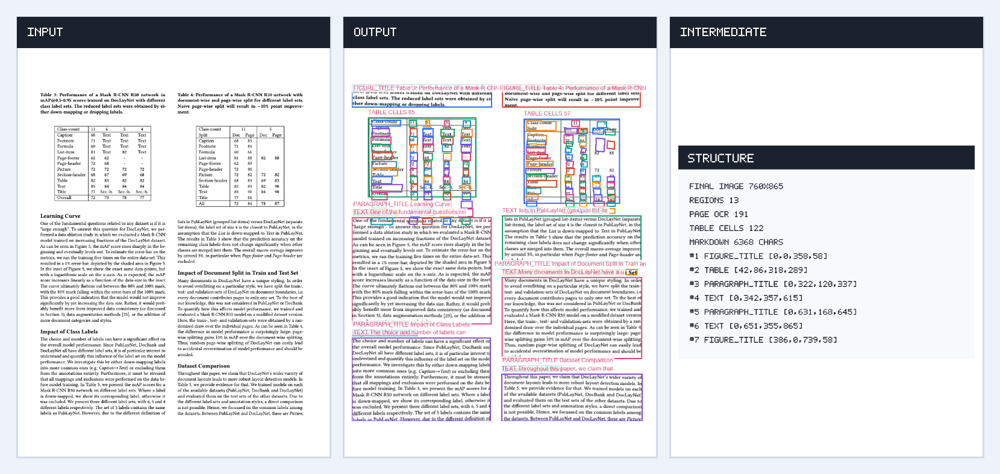

# paddleocr.js

[中文文档](./README_zh.md)

A lightweight TypeScript runtime for PaddleOCR / PaddleX ONNX inference.

The library focuses on the inference chain: preprocessing, ONNX Runtime calls,
postprocessing, presets, and high-level pipelines. It does not ship image decoders,
OpenCV, pyclipper, or model binaries. Your application loads the pixels and model
files, then passes them into this runtime.

## What It Supports

| Area | User-facing API |
| --- | --- |
| OCR det + textline orientation + rec | `PaddleOcrService` |
| Table Recognition V2 | `TableRecognitionV2Service` |
| PP-Structure-like document parsing | `PaddleStructureService` |
| Text detection / recognition modules | `DetectionService`, `RecognitionService` |
| Document / textline / table classification | `ImageClassificationService` |
| Layout / region / table-cell object detection | `ObjectDetectionService` |
| Table structure recognition | `TableStructureRecognitionService` |
| Formula recognition | `FormulaRecognitionService` |
| Text image unwarping | `TextImageUnwarpingService` |

Preset coverage includes PP-OCRv5 and PP-OCRv6 OCR models, document orientation,
textline orientation, table classification, UVDoc, PP-DocBlockLayout,
PP-DocLayout, SLANet, SLANeXt wired/wireless, RT-DETR table cell detectors, and
PP-FormulaNet families.

## Install

Install the runtime plus the ONNX Runtime backend you want to use:

```sh
npm install paddleocr onnxruntime-node
# or, for browser apps
npm install paddleocr onnxruntime-web
```

`onnxruntime-node` / `onnxruntime-web` are supplied by your application so the same
runtime can work in Node.js, Bun, and browsers.

## Models

Model binaries are not included in this source repository or the npm package.

Download official ONNX models from PaddlePaddle's Hugging Face repositories when
they exist. When official ONNX assets are not available, use the converted and
locally verified assets from [`paddleocr-js-onnx`](./paddleocr-js-onnx/README.md).

The runtime does not read from a fixed model directory. Your application only
needs to load ONNX models as `ArrayBuffer`s, load OCR dictionaries, labels, or
formula tokenizers as data, then pass them to the service or module APIs.

## Quick OCR Example

This example assumes your application has already decoded an image into
`{ width, height, data }`, where `data` is grayscale, RGB, or RGBA pixels.

```ts
import { readFile } from "node:fs/promises";
import * as ort from "onnxruntime-node";
import { PaddleOcrService } from "paddleocr";

function toArrayBuffer(buffer: Buffer): ArrayBuffer {
    return buffer.buffer.slice(
        buffer.byteOffset,
        buffer.byteOffset + buffer.byteLength
    ) as ArrayBuffer;
}

const [detModel, recModel, textlineModel, dictText] = await Promise.all([
    readFile("paddleocr-js-onnx/ppocr_v6_small/PP-OCRv6_small_det_infer.onnx"),
    readFile("paddleocr-js-onnx/ppocr_v6_small/PP-OCRv6_small_rec_infer.onnx"),
    readFile(
        "paddleocr-js-onnx/pp_lcnet_x0_25_textline_ori/PP-LCNet_x0_25_textline_ori_infer.onnx"
    ),
    readFile("paddleocr-js-onnx/ppocr_v6_small/ppocrv6_dict.txt", "utf-8"),
]);

const ocr = await PaddleOcrService.createInstance({
    ort,
    modelPreset: "PP-OCRv6_small",
    detection: {
        modelBuffer: toArrayBuffer(detModel),
    },
    recognition: {
        modelBuffer: toArrayBuffer(recModel),
        charactersDictionary: dictText.trimEnd().split(/\r?\n/),
    },
    textlineOrientation: {
        modelBuffer: toArrayBuffer(textlineModel),
        threshold: 0.9,
    },
});

const results = await ocr.recognize(inputPixels, {
    onProgress(event) {
        console.log(event.type, event.stage, event.progress);
    },
});

const text = ocr.processRecognition(results).text;
console.log(text);
```

## Input Pixels

Runtime APIs accept caller-owned pixels:

```ts
interface ImageInput {
    width: number;
    height: number;
    data: Uint8Array;
}
```

`data` may be grayscale, RGB, or RGBA. The runtime normalizes it to RGB and
ignores alpha. Decode PNG/JPEG/PDF pages in your application with the library that
fits your stack.

## Examples

See [`examples/README.md`](./examples/README.md) for runnable module and pipeline
examples. The result images are generated from real ONNX inference and are meant
to show what each module returns.

| Pipeline | Result |
| --- | --- |
| OCR |  |
| Table Recognition V2 |  |
| PP-Structure-like parsing |  |

## Progress Events

OCR services can report progress during detection and recognition:

```ts
await ocr.recognize(inputPixels, {
    onProgress(event) {
        if (event.type === "det") {
            console.log(event.stage, event.detectedCount);
        }
        if (event.type === "rec" && event.stage === "item") {
            console.log(event.result?.text);
        }
    },
});
```

Event contract:

- `det`: `preprocess`, `infer`, `postprocess`
- `rec`: `start`, one `item` per detected text box, `complete`
- `rec/item`: includes `result` and `box`
- `det/postprocess`: includes `detectedCount`

## Presets and Overrides

The high-level OCR preset names are:

`PP-OCRv5`, `PP-OCRv5_mobile`, `PP-OCRv5_server`, `PP-OCRv6`,
`PP-OCRv6_tiny`, `PP-OCRv6_small`, `PP-OCRv6_medium`.

Presets configure channel order, resize behavior, normalization, DB
postprocessing, and CTC output handling. You can still override detection,
recognition, ordering, and textline orientation options per call.

```ts
const strictResults = await ocr.recognize(inputPixels, {
    detection: {
        textPixelThreshold: 0.3,
        boxScoreThreshold: 0.6,
        unclipRatio: 1.5,
        limitType: "max",
        maxSideLimit: 4000,
    },
    ordering: {
        sortByReadingOrder: true,
        sameLineThresholdRatio: 0.15,
    },
});
```

## Parity Notes

The runtime follows official PaddleOCR / PaddleX preprocessing and
postprocessing at a high level, including OCR resize strategies, DB
postprocess, CTC decode, textline orientation correction, layout/object NMS,
table structure decoding, formula token decoding, and UVDoc output decoding.

Some operations are intentionally lightweight approximations instead of
bit-exact OpenCV/pyclipper clones. For example, rotated OCR crops use a
TypeScript perspective sampler, and table span recovery is a high-level
TypeScript implementation. These choices keep the runtime small and portable.

## Browser Notes

Browser applications usually load ONNX files with `fetch()` and pass
`ArrayBuffer`s into `createInstance()`. A Vite example lives at
[paddleocr-vite-example](https://github.com/X3ZvaWQ/paddleocr-vite-example).

## License

MIT
